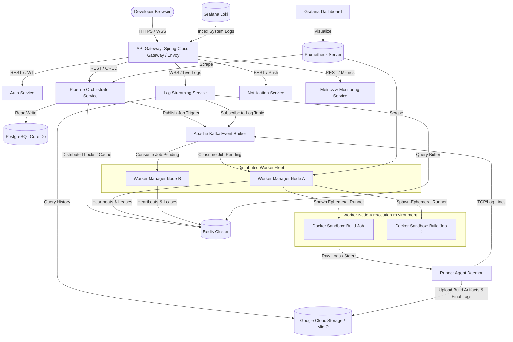
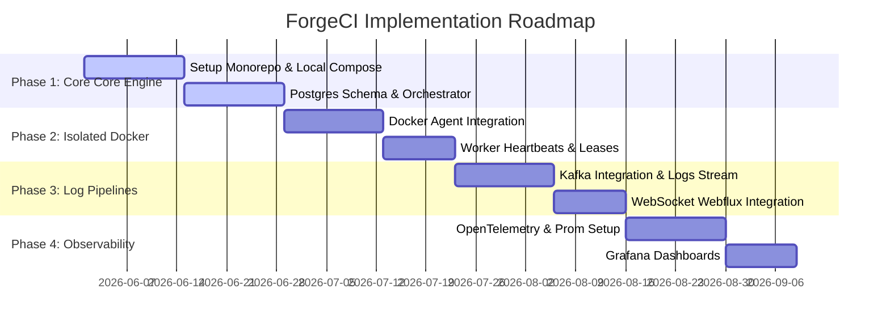

# ForgeCI: Production-Grade Distributed CI/CD Orchestration Platform
## Technical Architecture & System Design Specification

Welcome to the **ForgeCI Technical Architecture Blueprint**. This document outlines the end-to-end design, communication patterns, database models, infrastructure layout, and reliability strategies for building **ForgeCI**, a horizontally scalable, cloud-native distributed CI/CD platform designed to run isolated dockerized pipeline workloads with real-time feedback loops.

---

## 1. High-Level System Architecture

ForgeCI utilizes a highly decoupled, microservices-based, event-driven architecture designed to separate control plane operations (orchestration, scheduling, metadata management) from data plane operations (isolated execution of builds and streaming of log payloads). 

### 1.1 Architectural Overview Diagram


### 1.2 Synchronous vs. Asynchronous Communication Flow
*   **Synchronous Flow (REST / WebSockets)**: Used strictly for user-facing actions, authentication checks, schema validation, quick metadata retrieval, manual build cancellations, and UI WebSocket connections.
*   **Asynchronous Flow (Kafka / Redis PubSub)**: Used for all transactional steps in the build execution lifecycle, telemetry shipping, alerting triggers, and internal state machine progressions. This ensures the orchestrator is never blocked by high-latency runner operations or network partitioning.

---

## 2. Monorepo Structure

To maintain strong typing across the frontend and backend microservices, ForgeCI is organized as a unified monorepo. This allows shared DTOs, protobuf/Avro event schemas, and shared UI assets to be updated in atomic commits.

```text
forgeci/
├── apps/
│   ├── web/                              # Next.js App Router (Frontend)
│   │   ├── src/
│   │   │   ├── app/                      # Pages: dashboard, pipelines, executions
│   │   │   ├── components/               # Terminal, StageProgress, NodeMap
│   │   │   ├── hooks/                    # useWebSocket, useReactQuery
│   │   │   └── store/                    # Zustand state management
│   ├── api-gateway/                      # Spring Cloud Gateway
│   ├── auth-service/                     # Spring Boot Authentication & JWT Service
│   ├── orchestrator-service/             # Spring Boot Pipeline Control Plane
│   ├── worker-manager/                   # Daemon coordinating local docker runners
│   ├── log-streaming-service/            # Reactive WebFlux WebSocket Server for logs
│   ├── notification-service/             # Async email/Slack dispatcher
│   └── monitoring-service/               # OpenTelemetry & Prometheus aggregator
├── libs/
│   ├── event-schemas/                    # Protobuf / Avro schemas for Kafka events
│   │   ├── pipeline_triggered.proto
│   │   ├── job_pending.proto
│   │   ├── job_status_changed.proto
│   │   └── raw_log_line.proto
│   └── shared-dto/                       # Shared Java classes / TS interfaces
├── infra/
│   ├── docker/
│   │   ├── docker-compose.local.yml      # Local Postgres, Redis, Kafka, MinIO, Prometheus
│   │   └── dockerfiles/                  # Build configurations for custom runner environments
│   ├── k8s/                              # Production K8s manifests
│   │   ├── deployments/
│   │   ├── ingress.yaml
│   │   └── configmaps/
│   └── terraform/                        # GCP Infrastructure-as-Code
│       ├── main.tf
│       ├── variables.tf
│       └── outputs.tf
├── scripts/                              # Local setup, seeds, and build automation
├── package.json
└── pom.xml                               # Root Maven POM for Java multi-module compilation
```

---

## 3. Service-by-Service Breakdown

### 3.1 API Gateway
*   **Technologies**: Java 21, Spring Cloud Gateway, Spring Security.
*   **Responsibility**:
    *   Acts as a single entry point for all traffic. Handles TLS termination and routing.
    *   Validates JWT access tokens at the edge and injects `X-User-Id`, `X-Org-Id`, and `X-User-Roles` headers downstream.
    *   Implements token bucket rate limiting on a per-IP / per-user basis via Redis.
*   **Scaling Strategy**: Horizontally stateless. Scaled behind a Google Cloud Load Balancer (GCLB) based on CPU utilization metrics (>70%).

### 3.2 Auth Service
*   **Technologies**: Java 21, Spring Boot, Spring Security OAuth2 Client.
*   **Responsibility**:
    *   Coordinates GitHub OAuth login, issues stateless JWT Access Tokens (short-lived, 15 min) and persistent Refresh Tokens (long-lived, 7 days) stored in `HttpOnly`, secure, same-site cookies.
    *   Manages users, organizations, and Role-Based Access Control (RBAC) mapping (Owner, Admin, Operator, Viewer).
*   **Fault Tolerance**: Replicates session blacklists across Redis. Fallback local credentials storage in PostgreSQL with bcrypt hashing.

### 3.3 Pipeline Orchestrator Service
*   **Technologies**: Java 21, Spring Boot, Spring Data JPA, KafkaTemplate.
*   **Responsibility**:
    *   The platform's brains. Holds pipeline definitions, parses and validates YAML configuration schemas.
    *   Handles the lifecycle state machine of pipeline executions (Triggered $\to$ Pending $\to$ Running $\to$ Success/Failed).
    *   Publishes execution tasks to Kafka and processes worker execution reports.
*   **State Machine Design**: Uses a transactional state transition pattern to ensure out-of-order Kafka events cannot roll back an execution state (e.g., a delayed `Running` event cannot overwrite a finished `Success` state).

### 3.4 Worker Manager Service
*   **Technologies**: Java 21, Spring Boot, Docker Java SDK.
*   **Responsibility**:
    *   Runs on designated virtual machines or dedicated nodes with Docker access.
    *   Polls the designated partition of the Kafka `job-pending` topic.
    *   Registers itself with the Redis registry, sending heartbeats every 5 seconds.
    *   Pulls the repository code, spawns the isolated `Build Executor` container, configures mount paths, CPU, and Memory limits.
*   **Self-Healing**: If a runner container crashes or stalls, the local daemon captures the exit code, logs the error, terminates the container, cleans up Docker network interfaces, and reports the failure back to Kafka.

### 3.5 Log Streaming Service
*   **Technologies**: Java 21, Spring WebFlux (Reactive Stack), Project Reactor, Netty.
*   **Responsibility**:
    *   Maintains concurrent, full-duplex WebSocket connections with client browsers.
    *   Subscribes directly to Kafka `job-logs-raw` partitions and broadcasts streams targeting a specific `executionId`.
    *   Maintains a temporary tail buffer in Redis for newly connected clients who need the last $N$ lines instantly.
*   **Scaling & Backpressure**: Leverages WebFlux backpressure controls to prevent clients with slow network connections from exhausting WebSocket server memory. Utilizes Redis Pub/Sub to scale WebSockets horizontally across a stateless cluster behind a layer 7 load balancer with sticky sessions or WebSocket routing.

### 3.6 Notification Service
*   **Technologies**: Java 21, Spring Boot, Spring Email, Slack API SDK.
*   **Responsibility**:
    *   Listens to the `job-events` topic.
    *   Sends emails, triggers Slack Webhooks, or dispatches Github Commit Status API updates based on execution outcomes.
*   **Fault Tolerance**: Implements exponential backoff retry patterns with a Dead Letter Queue (DLQ) for failed notification deliveries.

### 3.7 Metrics/Monitoring Service
*   **Technologies**: Micrometer, Prometheus client, OpenTelemetry SDK.
*   **Responsibility**:
    *   Aggregates infrastructure, performance, and domain metrics (Active Workers, Queue Latency, Build Success Rate).
    *   Exposes clean `/actuator/prometheus` scraping endpoints.

### 3.8 Build Executor (Runner Agent)
*   **Technologies**: Go (statically compiled) or Java Native (GraalVM compilation for minimal footprint).
*   **Responsibility**:
    *   Runs inside the isolated ephemeral Docker sandbox container as the entrypoint.
    *   Executes pipeline commands sequentially (e.g., `mvn clean test`, `npm run build`).
    *   Tails stdout/stderr of the shell process and transmits the lines instantly to the log pipe, appending ANSI metadata.
    *   Uploads physical binary outputs (artifacts) to the object storage bucket upon completion.

---

## 4. Database Schema Design (PostgreSQL DDL)

To handle the scale of a production-grade platform, PostgreSQL is utilized as the primary transactional storage engine. High-traffic transaction tables such as `pipeline_executions`, `job_executions`, and `artifacts` are indexed strategically and ready for range partitioning on the `created_at` timestamp.

```sql
-- Core Organizations & Users
CREATE TABLE organizations (
    id UUID PRIMARY KEY DEFAULT gen_random_uuid(),
    name VARCHAR(255) NOT NULL UNIQUE,
    github_org_id BIGINT UNIQUE,
    created_at TIMESTAMP WITH TIME ZONE DEFAULT CURRENT_TIMESTAMP NOT NULL,
    updated_at TIMESTAMP WITH TIME ZONE DEFAULT CURRENT_TIMESTAMP NOT NULL
);

CREATE TABLE users (
    id UUID PRIMARY KEY DEFAULT gen_random_uuid(),
    email VARCHAR(255) NOT NULL UNIQUE,
    username VARCHAR(255) NOT NULL UNIQUE,
    github_user_id BIGINT UNIQUE,
    avatar_url VARCHAR(512),
    created_at TIMESTAMP WITH TIME ZONE DEFAULT CURRENT_TIMESTAMP NOT NULL
);

CREATE TABLE organization_members (
    organization_id UUID REFERENCES organizations(id) ON DELETE CASCADE,
    user_id UUID REFERENCES users(id) ON DELETE CASCADE,
    role VARCHAR(50) NOT NULL DEFAULT 'OPERATOR', -- OWNER, ADMIN, OPERATOR, VIEWER
    PRIMARY KEY (organization_id, user_id)
);

-- Repositories & Pipeline Specifications
CREATE TABLE repositories (
    id UUID PRIMARY KEY DEFAULT gen_random_uuid(),
    organization_id UUID NOT NULL REFERENCES organizations(id) ON DELETE CASCADE,
    name VARCHAR(255) NOT NULL,
    github_repo_id BIGINT UNIQUE NOT NULL,
    clone_url VARCHAR(512) NOT NULL,
    webhook_secret VARCHAR(255) NOT NULL,
    created_at TIMESTAMP WITH TIME ZONE DEFAULT CURRENT_TIMESTAMP NOT NULL,
    CONSTRAINT unique_repo_name_per_org UNIQUE(organization_id, name)
);

CREATE TABLE pipelines (
    id UUID PRIMARY KEY DEFAULT gen_random_uuid(),
    repository_id UUID NOT NULL REFERENCES repositories(id) ON DELETE CASCADE,
    name VARCHAR(255) NOT NULL,
    yaml_config TEXT NOT NULL, -- Holds the validated yaml execution schema
    created_by UUID REFERENCES users(id),
    created_at TIMESTAMP WITH TIME ZONE DEFAULT CURRENT_TIMESTAMP NOT NULL,
    updated_at TIMESTAMP WITH TIME ZONE DEFAULT CURRENT_TIMESTAMP NOT NULL
);

-- Distributed Worker Tracker
CREATE TABLE workers (
    id UUID PRIMARY KEY DEFAULT gen_random_uuid(),
    hostname VARCHAR(255) NOT NULL UNIQUE,
    ip_address VARCHAR(45) NOT NULL,
    status VARCHAR(50) NOT NULL DEFAULT 'IDLE', -- IDLE, BUSY, UNRESPONSIVE, TERMINATED
    cpu_cores INTEGER NOT NULL,
    memory_bytes BIGINT NOT NULL,
    tags TEXT[], -- e.g., ['docker', 'maven', 'gpu']
    last_heartbeat TIMESTAMP WITH TIME ZONE DEFAULT CURRENT_TIMESTAMP NOT NULL,
    created_at TIMESTAMP WITH TIME ZONE DEFAULT CURRENT_TIMESTAMP NOT NULL
);

-- Executions & Jobs Model
CREATE TABLE pipeline_executions (
    id UUID PRIMARY KEY DEFAULT gen_random_uuid(),
    pipeline_id UUID NOT NULL REFERENCES pipelines(id) ON DELETE CASCADE,
    trigger_type VARCHAR(50) NOT NULL, -- WEBHOOK, MANUAL, CRON
    triggered_by UUID REFERENCES users(id),
    commit_sha VARCHAR(40) NOT NULL,
    branch VARCHAR(255) NOT NULL,
    status VARCHAR(50) NOT NULL DEFAULT 'PENDING', -- PENDING, RUNNING, SUCCESS, FAILED, ABORTED
    started_at TIMESTAMP WITH TIME ZONE,
    finished_at TIMESTAMP WITH TIME ZONE,
    created_at TIMESTAMP WITH TIME ZONE DEFAULT CURRENT_TIMESTAMP NOT NULL
);

CREATE TABLE job_executions (
    id UUID PRIMARY KEY DEFAULT gen_random_uuid(),
    pipeline_execution_id UUID NOT NULL REFERENCES pipeline_executions(id) ON DELETE CASCADE,
    worker_id UUID REFERENCES workers(id),
    name VARCHAR(255) NOT NULL, -- Stage Name: e.g., "Build", "Lint", "Test", "Deploy"
    status VARCHAR(50) NOT NULL DEFAULT 'PENDING', -- PENDING, RUNNING, SUCCESS, FAILED, ABORTED
    exit_code INTEGER,
    execution_order INTEGER NOT NULL,
    started_at TIMESTAMP WITH TIME ZONE,
    finished_at TIMESTAMP WITH TIME ZONE,
    created_at TIMESTAMP WITH TIME ZONE DEFAULT CURRENT_TIMESTAMP NOT NULL
);

-- Output Artifacts
CREATE TABLE build_artifacts (
    id UUID PRIMARY KEY DEFAULT gen_random_uuid(),
    job_execution_id UUID NOT NULL REFERENCES job_executions(id) ON DELETE CASCADE,
    file_name VARCHAR(255) NOT NULL,
    storage_path VARCHAR(1024) NOT NULL, -- Path relative to bucket root
    file_size_bytes BIGINT NOT NULL,
    content_type VARCHAR(100) NOT NULL,
    created_at TIMESTAMP WITH TIME ZONE DEFAULT CURRENT_TIMESTAMP NOT NULL
);

-- Index Strategy for High Performance Scalability
CREATE INDEX idx_pipeline_exec_created ON pipeline_executions (created_at DESC);
CREATE INDEX idx_job_exec_parent ON job_executions (pipeline_execution_id, execution_order);
CREATE INDEX idx_workers_heartbeat ON workers (last_heartbeat) WHERE status != 'TERMINATED';
CREATE INDEX idx_repos_org ON repositories (organization_id);
```

### Partitioning & Scaling Strategy
As execution logs and pipeline history swell, the `pipeline_executions` and `job_executions` tables are designed to use PostgreSQL Declarative Range Partitioning by `created_at` in monthly intervals. This keeps index sizes small enough to fit within database RAM buffers, drastically accelerating read speeds during dashboard retrieval and history pruning.

---

## 5. API Design (REST API Spec)

ForgeCI API exposes clean REST endpoints versioned via URI paths. All authenticated requests require a Bearer token in the `Authorization` header.

### 5.1 Pipeline Management Endpoints

#### `POST /api/v1/pipelines`
Creates a new pipeline specification.
*   **Request Payload**:
```json
{
  "repositoryId": "4fbe7d56-fb9a-4122-8700-11234567890a",
  "name": "Production Release Build",
  "yamlConfig": "stages:\n  - name: Build\n    commands:\n      - npm install\n      - npm run build\n  - name: Test\n    commands:\n      - npm test"
}
```
*   **Response (201 Created)**:
```json
{
  "id": "7ca64738-d6a1-4322-9ca9-23456789a12b",
  "name": "Production Release Build",
  "createdAt": "2026-05-25T22:15:00Z"
}
```

#### `POST /api/v1/pipelines/{id}/trigger`
Triggers an immediate workflow run.
*   **Request Payload**:
```json
{
  "branch": "main",
  "commitSha": "a6d89234857b2938cfd29c8e1a7b0c9d3e4f5a6b"
}
```
*   **Response (202 Accepted)**:
```json
{
  "executionId": "8da7c438-e692-4112-bcb4-f182bc839d01",
  "status": "PENDING",
  "queuePosition": 1
}
```

#### `GET /api/v1/executions/{executionId}`
Retrieves detailed status metrics and runner telemetry.
*   **Response (200 OK)**:
```json
{
  "id": "8da7c438-e692-4112-bcb4-f182bc839d01",
  "status": "RUNNING",
  "triggerType": "MANUAL",
  "startedAt": "2026-05-25T22:15:05Z",
  "finishedAt": null,
  "stages": [
    {
      "stageId": "a92e10f1-4322-89cd-bd34-f89a9c12ab34",
      "name": "Build",
      "status": "SUCCESS",
      "exitCode": 0,
      "startedAt": "2026-05-25T22:15:05Z",
      "finishedAt": "2026-05-25T22:15:35Z"
    },
    {
      "stageId": "b18f88c8-18e3-4fde-92ca-3cf14a1a3bf9",
      "name": "Test",
      "status": "RUNNING",
      "exitCode": null,
      "startedAt": "2026-05-25T22:15:36Z",
      "finishedAt": null
    }
  ]
}
```

#### `GET /api/v1/executions/{executionId}/logs?offset=0&limit=500`
Fetch static historical logs (paginated) once the build has finished executing.
*   **Response (200 OK)**:
```json
{
  "executionId": "8da7c438-e692-4112-bcb4-f182bc839d01",
  "lines": [
    {"timestamp": "2026-05-25T22:15:06Z", "content": "\u001b[32m✔ Installing dependencies...\u001b[0m"},
    {"timestamp": "2026-05-25T22:15:20Z", "content": "added 432 packages in 14s"}
  ],
  "nextOffset": 502,
  "eof": false
}
```

---

## 6. Kafka Topic Design

Apache Kafka handles state transition isolation and event-driven workload dispatching. We use explicit partitioning keys to maintain chronological log sequence order.

```text
               +---------------------------+
               |  pipeline-triggers        | (Key: repository_id)
               +-------------+-------------+
                             |
                             v
               +---------------------------+
               |  job-pending              | (Key: worker_tag)
               +-------------+-------------+
                             |
                             v
               +---------------------------+
               |  job-events               | (Key: execution_id)
               +-------------+-------------+
                             |
                             v
               +---------------------------+
               |  job-logs-raw             | (Key: job_execution_id)
               +---------------------------+
```

### 6.1 Topic Configurations
| Topic Name | Partitions | Replication Factor | Retention Period | Cleanup Policy | Part Key |
| :--- | :--- | :--- | :--- | :--- | :--- |
| `pipeline-triggers` | 12 | 3 | 7 Days | `delete` | `repository_id` |
| `job-pending` | 24 | 3 | 3 Days | `delete` | `worker_tag` |
| `job-events` | 24 | 3 | 14 Days | `delete` | `execution_id` |
| `job-logs-raw` | 32 | 3 | 24 Hours | `delete` | `job_execution_id` |

### 6.2 Partitioning Key Strategy
*   **`job-logs-raw`**: Must use `job_execution_id` as the message key. This guarantees that all logs originating from a single running container are sequentially ordered, routing to the same partition and thread inside the Log Streamer service, preventing out-of-order log rendering in the client's terminal.
*   **`job-pending`**: Uses the `worker_tag` (e.g. `docker-runner`, `ios-builder`) as the key to allow workers to pick up tasks designated for their specialized environments.

---

## 7. Redis Strategy

Redis is not just a cache but a key coordination component. It handles state locks, real-time worker maps, rates, and high-frequency UI status checks.

```text
Redis Cluster
  ├── Hash    --> worker:{worker_id}         (Telemetry, registration keys)
  ├── ZSet    --> workers:active             (Worker heartbeat TTL scoreboard)
  ├── String  --> lock:pipeline:{id}         (Distributed concurrency barrier)
  ├── String  --> rate:limit:{ip_address}    (API Gateway rate limit token bucket)
  └── Stream  --> logs:buffer:{job_id}       (First 1000 lines reactive cache)
```

### 7.1 Caching & Core Data Structures
1.  **Distributed Lock (Redlock)**:
    *   *Key Pattern*: `lock:pipeline:{pipeline_id}`
    *   *Use Case*: Acquired before running a pipeline run creation script to avoid duplicate parallel runs triggered by closely-timed duplicate webhooks.
2.  **Worker Registration & Heartbeat**:
    *   *Key Pattern*: `worker:{worker_id}` (Hash) storing metadata: `ip_address`, `status`, `capacity`, `running_jobs`.
    *   *Activity Scoreboard*: `workers:active` (Sorted Set - `ZSET`). The score is the current Unix epoch millisecond of the last received heartbeat. A scheduler runs inside Orchestrator, polling this ZSET via `ZRANGEBYSCORE` to find and evict workers that have failed to heartbeat within 30 seconds.
3.  **Active Logging Buffer**:
    *   *Key Pattern*: `logs:buffer:{job_execution_id}` (Redis Stream - `XADD`).
    *   *Use Case*: Acts as a circular logging buffer storing the first 1000 lines of logs using max-length options (`MAXLEN ~ 1000`). When a developer opens a build page, they pull these cached log lines instantly instead of waiting for database or S3 fetches.

---

## 8. WebSocket Architecture & Real-Time Log Pipeline

To provide a low-latency, "real-time" streaming terminal, the system bypasses traditional long-polling or HTTP chunking, executing an end-to-end event pipeline instead.

### 8.1 Data Stream Topology
```text
[Runner Stdout/Stderr]
         | (Piped within Docker Container)
         v
[Runner Agent Daemon]
         | (Batch pushes every 100ms via TCP to prevent buffer exhaustion)
         v
[Kafka: job-logs-raw]
         | (Partitioned by job_execution_id)
         v
[Log Streaming Service] (Spring WebFlux / WebSockets)
         |
         +--> [Clients / Developers Browser UI]
```

### 8.2 Log Flow Lifecycle
1.  **Runner Execution**: The isolated container executes user steps. The statically compiled runner agent tails files and sends blocks of console lines with microsecond-level timestamps to Kafka.
2.  **Kafka Buffer**: Logs sit in Kafka's ultra-fast commit logs.
3.  **Webflux WebSocket Routing**: A React Query WebSocket hook establishes a connection to `wss://forgeci.dev/api/v1/stream/logs?jobId={jobId}`. Spring WebFlux logs onto the specific partition of `job-logs-raw`, filters messages by `jobId`, and dispatches standard websocket messages.
4.  **Backpressure Handling**: Webflux uses backpressure boundaries (`onBackpressureBuffer`). If the frontend is lagging, logs are temporarily queued on the server's reactive heap before Kafka throttles reading.
5.  **Persistence Hand-off**: When the runner container exits, the execution agent uploads the full plaintext log file to Google Cloud Storage. The orchestrator records `eof: true` in the DB and cleanups the temporary Redis cache. Subsequent reads of historical builds point directly to GCS.

---

## 9. Deployment Architecture

ForgeCI is built from the ground up to be cloud-native and deployable to Google Cloud Platform (GCP).

### 9.1 Multi-Zone Infrastructure Diagram (GCP)
```text
                     +---------------------------------------+
                     |         Vercel (Next.js App)          |
                     +-------------------+-------------------+
                                         | (HTTPS / WSS)
                                         v
                     +-------------------+-------------------+
                     |         Cloud DNS & GCLB (HTTPS)      |
                     +-------------------+-------------------+
                                         |
               +-------------------------+-------------------------+
               | (Private Subnet / Shared VPC)                     |
               |                                                   |
               |     +---------------------------------------+     |
               |     |  Google Kubernetes Engine (GKE Cluster)|     |
               |     |                                       |     |
               |     |   [API Gateway Pods]                  |     |
               |     |   [Auth / Orchestrator Pods]          |     |
               |     |   [Reactive Log Streamer Pods]        |     |
               |     |                                       |     |
               |     |   [Worker Manager DaemonSet]          |     |
               |     |       | (Spawns isolated Runners)     |     |
               |     |       v                               |     |
               |     |   [Ephemeral Pod Execution Nodes]     |     |
               |     +-------+-----------------------+-------+     |
               |             |                       |             |
               |             v                       v             |
               |     +-------+-------+       +-------+-------+     |
               |     |Cloud SQL PgSQL|       | Memorystore   |     |
               |     +---------------+       | Redis Cluster |     |
               |                             +---------------+     |
               |                                                   |
               +---------------------------------------------------+
```

### 9.2 Infrastructure Provisioning Details
*   **Frontend**: Next.js App Router deployed directly to Vercel with optimized static routing and edge server rendering.
*   **Backend Compute**: **Google Kubernetes Engine (GKE)** running in Autopilot mode. GKE maintains an autoscaling node pool mapping to high-performance VM types.
*   **Database**: **Cloud SQL (PostgreSQL 16)** configured in High-Availability (HA) multi-zone mode. Enabled with continuous point-in-time recovery (PITR).
*   **Message Broker**: **Confluent Cloud Kafka**. Fully managed, triple-replicated across multiple zones, with IAM configurations mapped via service accounts.
*   **Object Storage**: **Google Cloud Storage (GCS)** standard buckets configured with Lifecycle Policies (transitioning execution logs to Coldline storage after 90 days to minimize data cost).

---

## 10. Frontend Architecture

The frontend aesthetic must feel premium, dark, minimal, and highly professional—similar in visual polish, spatial breathing room, and execution clarity to linear.app or onyx-engine.

```text
web/
├── src/
│   ├── app/
│   │   ├── (auth)/                       # Landing page, Login page
│   │   ├── (dashboard)/
│   │   │   ├── pipelines/                # Pipelines view
│   │   │   ├── executions/               # Build timeline visualizers
│   │   │   └── monitoring/               # Live infrastructure monitoring maps
│   ├── components/
│   │   ├── ui/                           # Primitive components (buttons, dialogs)
│   │   ├── terminal/
│   │   │   ├── XTermConsole.tsx         # High-speed Canvas-based terminal viewer
│   │   │   └── ANSIColorFilter.ts        # Parses bash outputs
│   │   ├── stages/
│   │   │   ├── StageNode.tsx             # Interactive pipeline step visualizers
│   │   │   └── ExecutionTimeline.tsx     # Timings, durations, worker markers
│   ├── store/
│   │   └── useWorkspaceStore.ts          # State tracking for dashboard operations
```

### 10.1 UI Core Components & State Architecture
1.  **State Management (Zustand)**: Used exclusively for global UI state like the selected workspace, sidebar toggle state, user permissions, and layout setups.
2.  **Server Synchronizer (React Query)**: Caches REST payloads (pipeline listings, repository structures, worker counts) and handles optimistic UI mutations when pipelines are executed or aborted.
3.  **Live Visual Terminal (XTerm.js / Custom Canvas)**:
    *   Tapping into custom canvas buffers prevents browser layouts from reflowing when logs arrive at speeds of $>10,000$ lines per second.
    *   Supports ANSI escape codes to preserve colorized test outputs from frameworks like Maven or Jest.

---

## 11. Complete System Roadmap

A step-by-step path detailing the transition from a local MVP to a production-grade enterprise system.



### Milestone 1: Local Monolithic Core & Isolated Execution
*   Develop Monorepo architecture, Spring Cloud Gateway, and basic Postgres schemas.
*   Deploy a lightweight Worker Manager that intercepts mock jobs and spawns localized Docker containers running isolated node tasks.

### Milestone 2: Event-Driven Kafka Dispatching & Heartbeats
*   Integrate actual Apache Kafka brokers. Replace direct REST triggers with async queue pipelines.
*   Implement the Redis-backed Sorted Set heartbeats dashboard for workers.

### Milestone 3: High-Speed WebSockets & React Terminal
*   Design the reactive Spring WebFlux WebSocket server.
*   Construct the Next.js dark-themed Terminal dashboard powered by `XTerm.js` for colorized log rendering.

### Milestone 4: Cloud-Native GCP Infrastructure
*   Convert the stack to Google Cloud. Configure GKE clusters, Cloud SQL, Memorystore Redis, and Confluent Cloud.
*   Draft Terraform configs to build standard environments with single-command workflows.

### Milestone 5: Observability & Production Hardening
*   Incorporate OpenTelemetry hooks inside the Orchestrator, Worker Manager, and Log Streamer services.
*   Setup Grafana, Prometheus, and Loki collectors to monitor CPU pipelines, queue latency, and JVM performance.

---

## 12. Production Deployment & GCP Setup

### 12.1 Environment Variable Architecture

#### Backend Service (`orchestrator-service/src/main/resources/application.yml`)
```yaml
spring:
  application:
    name: orchestrator-service
  datasource:
    url: jdbc:postgresql://${DB_HOST:localhost}:5432/${DB_NAME:forgeci}
    username: ${DB_USER}
    password: ${DB_PASS}
  data:
    redis:
      host: ${REDIS_HOST:localhost}
      port: ${REDIS_PORT:6379}
      password: ${REDIS_PASS}
  kafka:
    bootstrap-servers: ${KAFKA_BOOTSTRAP_SERVERS}
    properties:
      security.protocol: SASL_SSL
      sasl.mechanism: PLAIN
      sasl.jaas.config: org.apache.kafka.common.security.plain.PlainLoginModule required username='${KAFKA_KEY}' password='${KAFKA_SECRET}';
```

#### Frontend (`apps/web/.env.production`)
```env
NEXT_PUBLIC_API_URL=https://forgeci.dev/api/v1
NEXT_PUBLIC_WS_URL=wss://forgeci.dev/api/v1/stream
NEXTAUTH_URL=https://forgeci.dev
GITHUB_CLIENT_ID=ov23_github_client_id_here
GITHUB_CLIENT_SECRET=github_client_secret_here
```

### 12.2 Security Secrets Management
To maintain security, standard text passwords are forbidden inside repository commits.
*   **GCP KMS**: Service API credentials, database keys, and Github secrets are stored in **Google Secret Manager**.
*   **External Secrets Operator (ESO)**: Kubernetes clusters run ESO, pulling credentials from Secret Manager and mapping them as native Kubernetes `Secret` resources read by pods at startup.

---

## 13. Security Architecture

Running arbitrary developer scripts poses immense security risks. ForgeCI mitigates this through multi-tiered isolation strategies.

```text
+-----------------------------------------------------------+
| GKE Node (Isolated VM Instance)                            |
|                                                           |
|  +-----------------------------------------------------+  |
|  | Ephemeral Docker Runner Sandbox                     |  |
|  |                                                     |  |
|  |  * Strict CPU Limit: 2.0 Cores                      |  |
|  |  * Strict RAM Limit: 4.0 GB                         |  |
|  |  * Read-Only Root Filesystem                        |  |
|  |  * Metadata Block Block (169.254.169.254 / GCP Link)|  |
|  |  * Isolated User Namespaces (gRPC Blocked)          |  |
|  +-----------------------------------------------------+  |
+-----------------------------------------------------------+
```

1.  **Runner Sandbox Isolation**:
    *   Ephemeral build containers run using standard non-root users (`--user 1000:1000`).
    *   **Resource Throttling**: Enforces strict CPU (`--cpus=2.0`) and RAM (`--memory=4g`) thresholds to prevent denial-of-service (DoS) memory exhaustion on host nodes.
2.  **Network Boundary Separation**:
    *   Docker containers execute on custom bridged network namespaces that block access to the internal GKE cluster VPC or Cloud SQL backends.
    *   `iptables` rules block outbound network access to cloud instance metadata services (e.g. `169.254.169.254`).
3.  **Secrets Encryption**:
    *   Customer repository credentials or deployment keys are encrypted at rest in PostgreSQL using AES-256-GCM. Decryption keys are managed via GCP KMS. Secrets are injected as runtime variables inside worker containers only during their execution.

---

## 14. Observability & Monitoring Setup

### 14.1 Metrics & Alert Targets
We track key Golden Signals to monitor platform reliability:
*   `forgeci_build_queue_latency_seconds`: Time elapsed from build triggering to execution launch. An alert is sent to Slack if latency exceeds 60 seconds.
*   `forgeci_worker_count`: The count of active workers grouped by status (`IDLE`, `BUSY`). If the count drops below 2, a scaling metric triggers a VM host expansion.
*   `forgeci_job_execution_failures_total`: Aggregates systematic failure counts (differentiating between compilation failures and runner timeout crashes).

### 14.2 Observability Stack Configuration
*   **Grafana Loki**: Configured with a vector log daemon that routes system logs from all microservices, enabling cross-service correlation tracing.
*   **Distributed Tracing (OpenTelemetry)**: Traces user requests from the API Gateway to the Orchestrator, Kafka, and the Worker Manager using a correlation ID, passing the `traceparent` context header down the event stream.

---

## 15. Resume-Worthy Engineering Highlights

For backend and system engineering roles, these complex architectural elements demonstrate advanced distributed systems knowledge:

1.  **Reactive Backpressure Log Pipeline**: Designing a logging flow that handles high throughput by leveraging Kafka partitions keyed by job ID, coupled with Spring WebFlux reactive streams. This approach prevents buffer overflows and isolates websocket server resources.
2.  **Active Heartbeat Eviction Engine**: Implementing a distributed worker tracker using Redis Hashes and Sorted Sets to register nodes, detect unresponsive workers within 30 seconds via active epoch score tracking, and trigger automatic job failover.
3.  **Secure Multi-Tenant Ephemeral Execution**: Configuring isolated build sandboxes with strict CPU, memory, and networking limits, protecting the underlying hosting host nodes from malicious script execution.
4.  **Idempotent Event Processing Engine**: Developing a deduplication table mechanism in PostgreSQL to ensure that duplicate Kafka events (resulting from network hiccups or consumer group rebalances) do not cause duplicate execution.

---

## 16. Recruiter Demo Strategy & Scenario

To showcase the platform's features to recruiters, follow this step-by-step interactive demo flow:

### The "Unplug a Node" Resilience Test
1.  **Open two browser tabs**: Tab A shows the **Worker Monitoring Dashboard**, displaying three active nodes. Tab B shows a **Live Build Terminal** executing a large compilation job on Worker 3.
2.  **Trigger the failure**: Simulate a VM failure by shutting down Worker 3 via the CLI (`docker stop worker-3`).
3.  **Show the recovery**:
    *   Within 15-30 seconds, the Worker Monitor turns red, indicating Worker 3 is `UNRESPONSIVE`.
    *   The **Active Heartbeat Eviction Engine** triggers. The orchestrator catches the event, cancels the stalled build task, and sets the execution status to `PENDING` for a retry.
    *   An idle worker (Worker 1) picks up the job, restarts the pipeline run, and resumes streaming logs to Tab B automatically.

---
*The technical architecture is now defined. The team is ready to begin implementing the foundation, starting with the monorepo configuration, local compose infrastructure, and core database models.*
